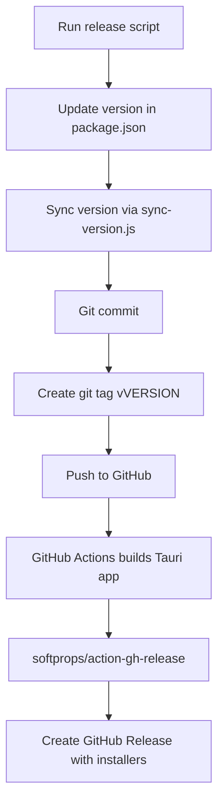

# App Release Guide

## How to Release the Application

This guide covers releasing the full Canadian Payroll System application (frontend + Tauri backend).

### Workflow Overview



### Step-by-Step Release Process

**1. Run the release script with a version bump type:**

```bash
node scripts/release.js --bump patch    # e.g., 26.8.0 → 26.8.1
node scripts/release.js --bump minor    # e.g., 26.8.0 → 26.9.0
node scripts/release.js --bump major    # e.g., 26.8.0 → 27.0.0
```

Or specify an exact version:

```bash
node scripts/release.js --version "26.8.0"
```

**Note:** On Windows, use direct `node` execution rather than `npm run` scripts.

**2. The script will:**
- Read current version from `package.json`
- Calculate or use specified new version
- Update `package.json` version field
- Run `sync-version.js` to propagate version to all files
- Create a git commit with message `release: v{version}`
- Create a git tag `v{version}`
- Ask whether to push to origin

**3. When pushed, GitHub Actions automatically:**
- Triggers on tags matching `v*`
- Builds the Tauri application for Windows
- Creates a GitHub Release via `softprops/action-gh-release`
- Attaches the Windows installer (`.exe` or `.msi`) as a release asset

### Version Numbering

The project uses **calendar-based versioning**:
- **Major:** Year (e.g., `26` for 2026, `27` for 2027)
- **Minor:** Feature release number within the year
- **Patch:** Bug fixes between releases

Example: Version `26.8.0` = Year 2026, 8th release, no patches yet

### Files Updated During Release

| File | What Changes |
|------|-------------|
| `package.json` | `version` field |
| `src-tauri/Cargo.toml` | `package.version` |
| `src-tauri/tauri.conf.json` | `version` |
| `src/__tests__/setup.ts` | Version references |
| Frontend source files | Any hardcoded version strings |

### How GitHub Actions Builds

The build workflow (defined in GitHub Actions) runs:

1. Checkout code
2. Install Node.js dependencies
3. Build frontend with Vite
4. Build Tauri app for Windows
5. Create GitHub Release with artifacts

### Important Notes

1. **Version format** - Use semver format: `MAJOR.MINOR.PATCH` (e.g., `26.8.0`)
2. **Tags are permanent** - Git tags cannot be reused. If you make a mistake, create a new version
3. **GitHub Release naming** - Releases are named after the tag (e.g., `v26.8.0`)
4. **Windows-only builds** - Currently CI only builds Windows installers

### Manual Steps (If Needed)

If the script fails or you need to do it manually:

```bash
# 1. Update version
npm version patch  # or minor, major

# 2. Sync version to all files
node scripts/sync-version.js

# 3. Commit and tag
git add -A
git commit -m "release: v26.8.0"
git tag v26.8.0

# 4. Push
git push origin main
git push origin v26.8.0
```

### Comparing Config vs App Releases

| Aspect | Config Release | App Release |
|--------|---------------|-------------|
| **Script** | `release-config.js` | `release.js` |
| **Tag Pattern** | `config-YYYY` | `vX.Y.Z` |
| **What changes** | Tax rate JSON files | Code + config |
| **Triggers CI** | Config release workflow | App release workflow |
| **Assets** | `config/tax_rates_*.json` | Windows installers |
| **Purpose** | Tax update without app rebuild | Full application release |
