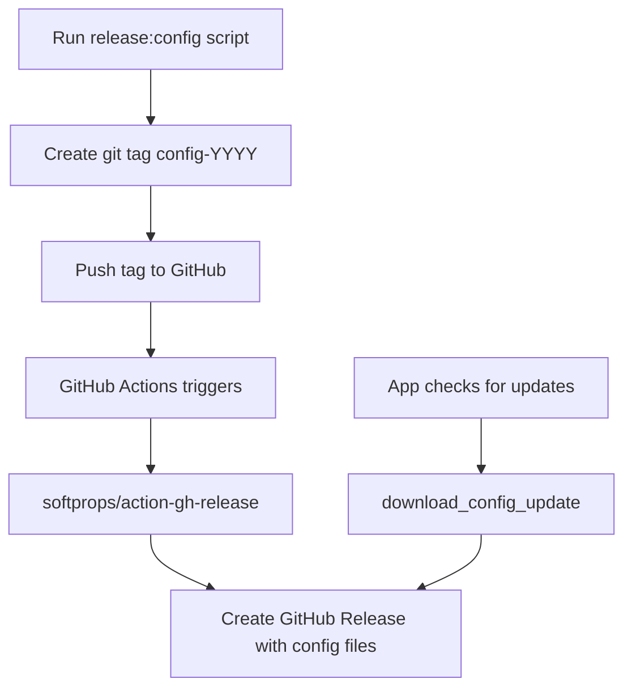

# Config Release Guide

## How to Release Config Files to GitHub for App Updates

The system uses a **GitHub Releases** workflow to distribute tax config updates to the app.

### Workflow Overview



### Step-by-Step Release Process

**1. Run the release script with the year:**
```bash
node scripts/release-config.js --year 2026
```

**Note:** The `npm run release:config -- --year 2026` syntax may not work reliably on Windows. Direct node execution is recommended.

**2. The script will:**
- Verify `config/tax_rates_2026.json` exists
- Create a git commit if there are changes
- Create a git tag `config-2026`
- Ask to push to origin

**3. When pushed, GitHub Actions automatically:**
- Triggers on tags matching `config-*`
- Creates a GitHub Release via `softprops/action-gh-release`
- Attaches all `config/tax_rates_*.json` files as release assets

### How the App Downloads Updates

The app uses these functions in `crates/cpr-core/src/tax/config.rs`:

| Function | Purpose |
|----------|---------|
| `check_github_update(year)` | Checks if newer config exists on GitHub |
| `download_github_config(year)` | Downloads and saves config to user's config directory |

The app checks the repository `raymond-digi/digiCaPr` for releases.

### Current Configuration

- **GitHub Owner:** `raymond-digi`
- **GitHub Repo:** `digiCaPr`
- **Release URL Pattern:** `https://github.com/raymond-digi/digiCaPr/releases/tag/config-2026`

### GitHub Actions Workflow

Located at `.github/workflows/config-release.yml`:

```yaml
name: Config Release

on:
  push:
    tags:
      - 'config-*'

jobs:
  release:
    runs-on: ubuntu-latest
    steps:
      - uses: actions/checkout@v4
      - name: Create Release
        uses: softprops/action-gh-release@v2
        with:
          tag_name: ${{ github.ref_name }}
          name: 'Tax Config ${{ github.ref_name }}'
          files: config/tax_rates_*.json
```

### Important Notes

1. **Config file must exist** - The release script will fail if `config/tax_rates_{year}.json` doesn't exist
2. **App reads release from latest tag** - The app fetches `https://api.github.com/repos/raymond-digi/digiCaPr/releases/latest`
3. **Downloaded configs are saved to user config directory:**
   - Windows: `%APPDATA%\CanadianPayrollSystem\`
   - macOS: `~/Library/Application Support/CanadianPayrollSystem/`
   - Linux: `~/.config/CanadianPayrollSystem/`
